# Quickbrush: AI Art for Your TTRPG Adventures

Transform your tabletop RPG experience with **Quickbrush** - the AI-powered art generator designed specifically for game masters and players who need consistent, high-quality fantasy artwork on demand.

## Why Quickbrush?

### 🎨 Consistent Fantasy Style

Unlike generic AI art tools, Quickbrush generates images in a cohesive fantasy RPG aesthetic. Every piece of art maintains the same visual style, ensuring your characters, items, and scenes feel like they belong in the same world.

### 🎭 Character Consistency with Reference Images

Create a character once, then generate them in any pose, outfit, or situation you need:

- Upload a reference image of your character
- Generate new art showing them in different armor
- Place them in various settings and scenarios
- Keep their appearance consistent across your entire campaign

### ⚡ Seamless TTRPG Integration

Quickbrush isn't just another web tool - it integrates directly into the platforms you already use:

- **FoundryVTT Module**: Generate art without leaving your game
- **Obsidian Plugin**: Create images directly from your campaign notes *(pending approval)*
- **REST API**: Build your own integrations

---

## FoundryVTT Module: Art Generation in Seconds

The Quickbrush Foundry module brings AI art generation directly into your virtual tabletop. No more tab-switching, copying prompts, or downloading files - everything happens seamlessly within Foundry.

### Character with Outfit Changes

Need your character in different gear? Reference their existing portrait and specify what they're wearing. Quickbrush maintains character consistency while adapting to new equipment.

**Step 1:** Right-click the character sheet and click "Generate Character Image"

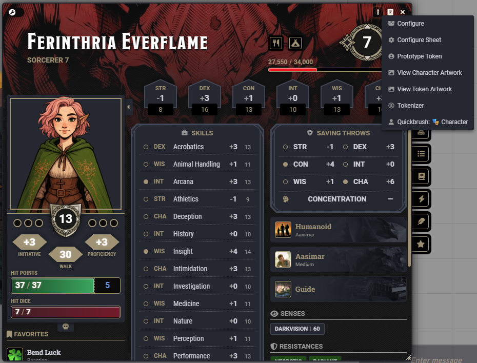

**Step 2:** The dialog auto-populates with the character description. Add context like "wearing a blue wizard hat"

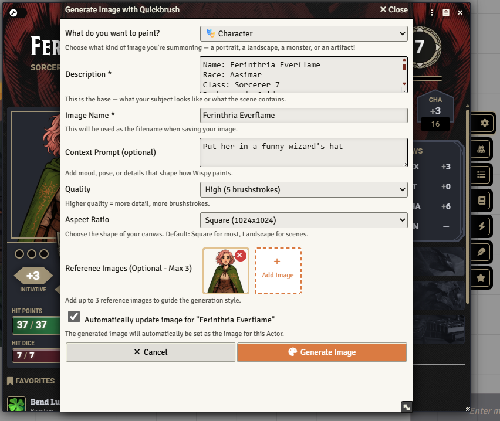

**Step 3:** Less than 30 seconds later, the image is generated and automatically set as the character portrait!

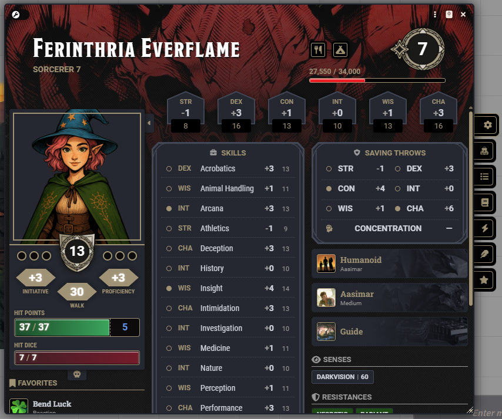

*Same character, different outfit - perfect for showing equipment changes*

---

### Creature and NPC Art

Generate stunning creature art directly from actor descriptions. Perfect for custom monsters and NPCs.

**Step 1:** Open the creature sheet and click the Quickbrush button in the header

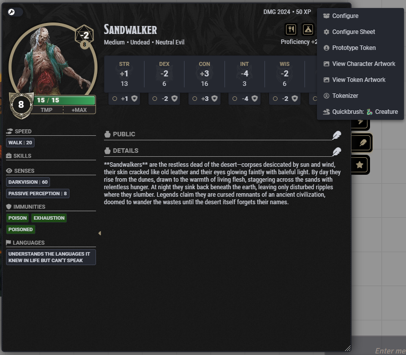

**Step 2:** Description auto-populated from the creature's biography. Adjust quality and generate.

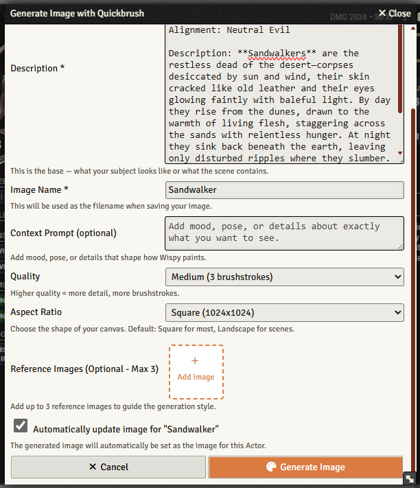

**Step 3:** Beautiful creature art generated and set automatically - meet the Sandwalker!

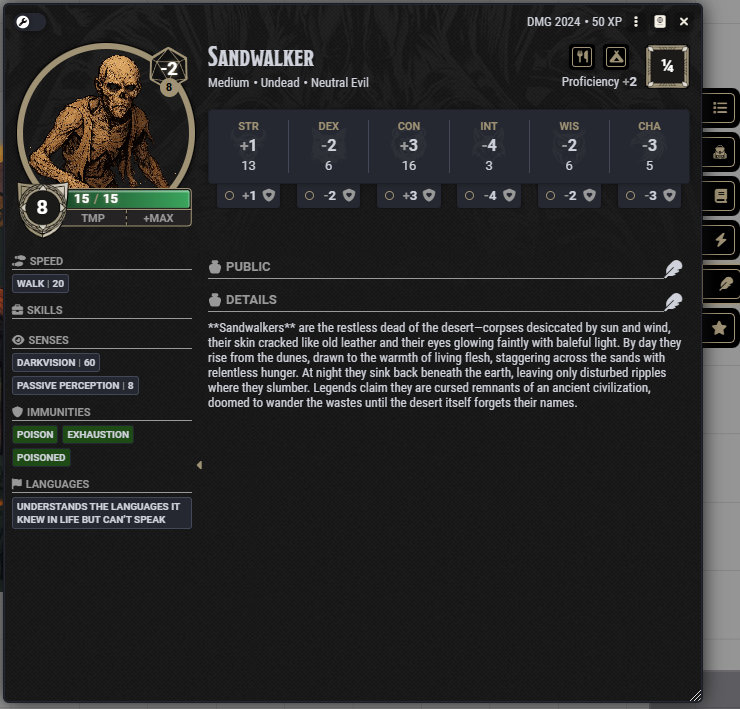

*From concept to finished creature art in under 30 seconds*

---

### Item and Equipment Art

Generate beautiful item art for weapons, armor, potions, and magical artifacts directly from your item descriptions.

**Step 1:** Right-click any item and select "Generate Item Image"

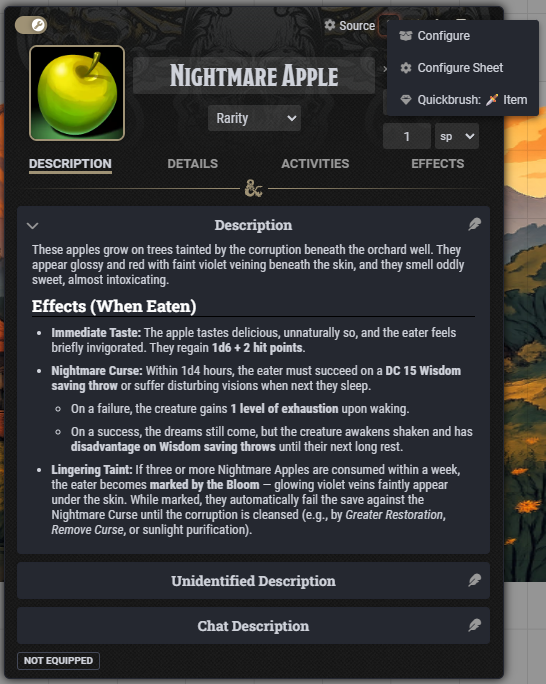

**Step 2:** Item description loads automatically. Set your quality and aspect ratio preferences.

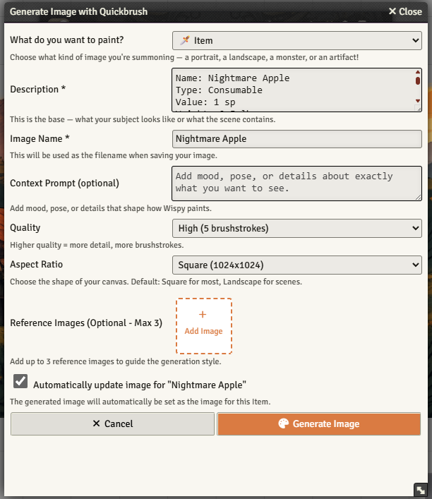

**Step 3:** Gorgeous item art generated and set - behold the Nightmare Apple!

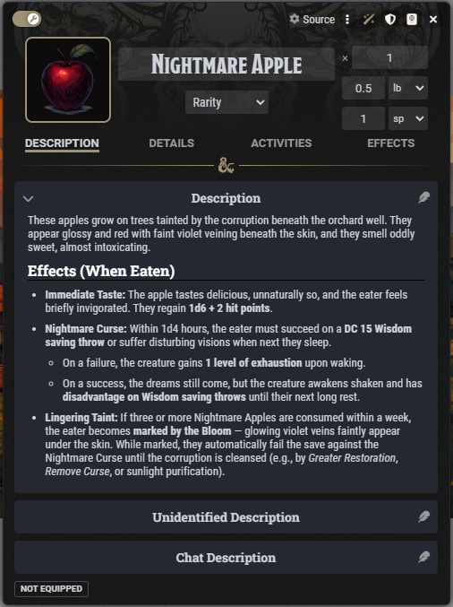

*Turn item descriptions into gorgeous inventory art instantly*

---

### Scene Generation with Character References

Bring your world to life with scene artwork that includes your NPCs and party members using reference images.

**Step 1:** Open a journal page and click the Quickbrush button

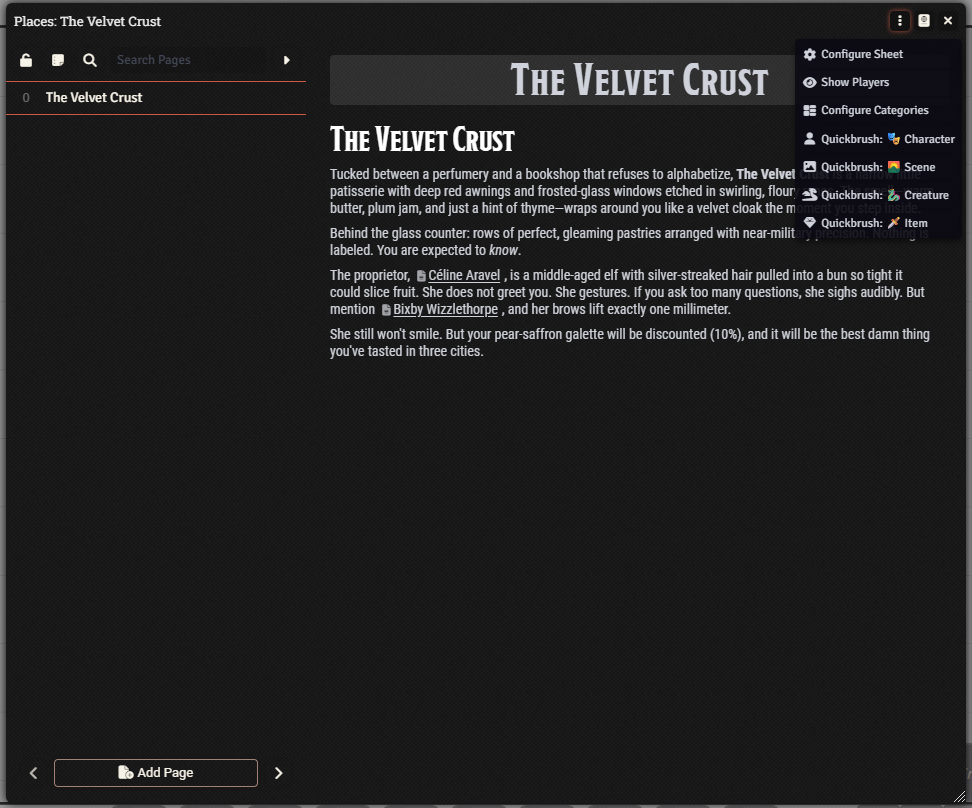

**Step 2:** Journal text auto-populates as the description. Add a reference image to include a character in the scene!

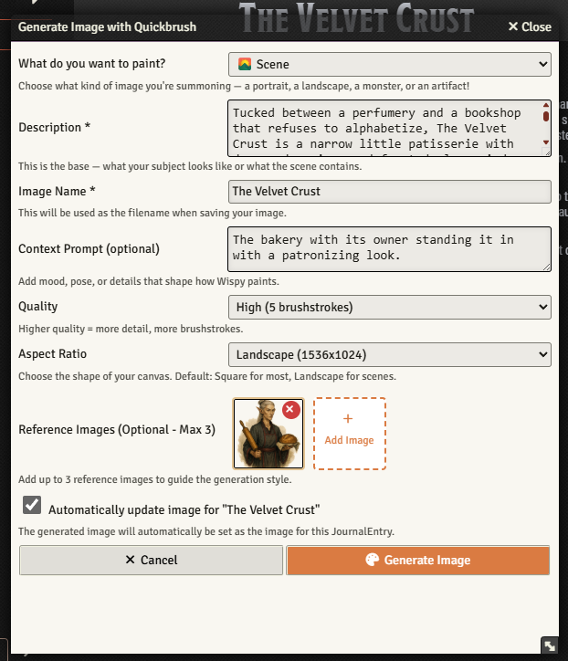

**Step 3:** The scene is generated with the referenced character appearing naturally in the setting

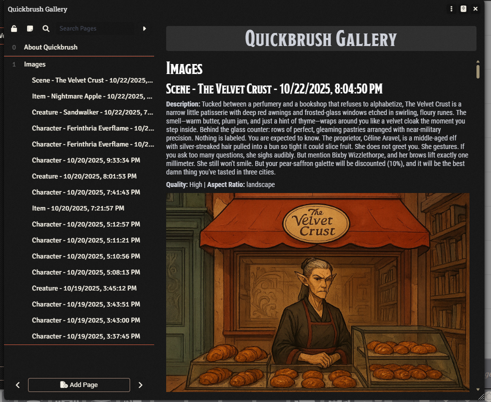

*Create immersive scenes featuring your NPCs and locations - the bakery owner appears in her shop!*

---

## How It Works

### 1. **Describe Your Vision**
Write natural descriptions in Foundry actors, items, or journals - or in your Obsidian notes.

### 2. **Add Context (Optional)**
Use reference images for character consistency, or add specific details about pose, lighting, or mood.

### 3. **Generate Instantly**
Click the Quickbrush button and watch your description transform into art in seconds.

### 4. **Automatic Organization**
All generated images are automatically saved to your Foundry files and added to a gallery journal for easy browsing.

---

## Quality Options

Choose the right quality for your needs:

- **Low Quality (1 brushstroke)**: Quick sketches and concept art
- **Medium Quality (3 brushstrokes)**: Refined detail for most uses
- **High Quality (5 brushstrokes)**: Fully rendered masterpieces

---

## Perfect For...

✅ **Game Masters** who need NPC portraits, monster art, and location images on the fly

✅ **Players** who want custom character art that evolves with their adventures

✅ **World Builders** creating consistent visual identities for their campaigns

✅ **Content Creators** developing modules, adventures, and supplements

✅ **Anyone** who loves TTRPGs and wants more art without breaking the bank

---

## Pricing Built for GMs

### Subscriptions (Best Value - 50% Savings)
- **Basic**: $5/month - 250 brushstrokes
- **Pro**: $10/month - 500 brushstrokes
- **Premium**: $20/month - 1000 brushstrokes
- **Ultimate**: $50/month - 2500 brushstrokes

### One-Time Packs (Never Expire)
- **Small**: $10 - 250 brushstrokes
- **Medium**: $20 - 500 brushstrokes
- **Large**: $40 - 1000 brushstrokes
- **Mega**: $100 - 2500 brushstrokes

*Subscribe for regular campaigns, buy packs for occasional use, or do both!*

---

## Getting Started

### FoundryVTT Module

1. In Foundry, go to **Add-on Modules** → **Install Module**
2. Paste this manifest URL:
   ```
   https://quickbrush.ai/foundry-module/module.json
   ```
3. Enable the module in your world
4. Get your API key from [quickbrush.ai/dashboard](https://quickbrush.ai/dashboard)
5. Add your API key in **Game Settings** → **Quickbrush AI Image Generator**

### Obsidian Plugin

Coming soon! The plugin is pending approval in the Obsidian community plugin directory.

### Web App

Generate images directly at [quickbrush.ai](https://quickbrush.ai) - no plugins required.

---

## Join the Community

Have questions? Want to share your creations? Join us on Discord! Find the invite link in the dashboard on [quickbrush.ai](https://quickbrush.ai).

---

## API Access

Build your own integrations with the Quickbrush REST API. Perfect for:
- Custom tools and workflows
- VTT platform integrations
- Campaign management apps
- Automated art generation pipelines

Full API documentation available at [quickbrush.ai/api/docs](https://quickbrush.ai/api/docs)

---

**Ready to bring your adventures to life?**

**[Get Started at quickbrush.ai →](https://quickbrush.ai)**

---

*"Your adventure needs a splash of color!" — Wispy, the Quickbrush halfling painter*
